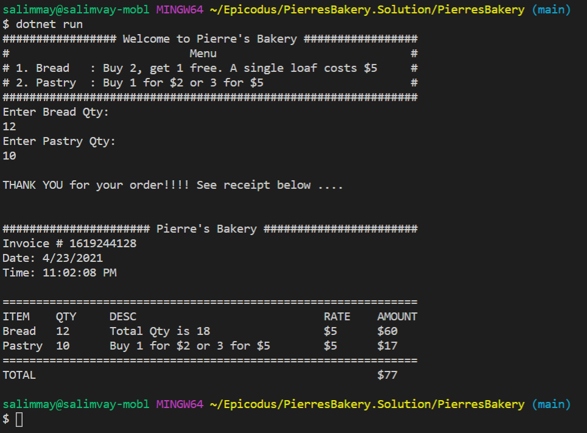

# Pierre's Bakery

##### Date: **04/23/2021**

#### By **_Salim Mayan_**

## Description

##### Hi! How about having some fresh bread or delicious pastry? Check this Console Application where you can order bakery items (start application to know all about the special offers available right now). This C# console application includes the following functionality ...

-  When user runs application, they should receive a prompt with a welcome message along with the cost for both `Bread` and `Pastry`.

-  User can specify how many loaves of `Bread` and how many `Pastry`s to be included in order.

-  Application returns the total cost of the order based on following special deal

	-  `Bread`: Buy 2, get 1 free. A single loaf costs $5.

	-  `Pastry`: Buy 1 for \$2 or 3 for $5.

-  See below image which indicates output of Console Application

| **Spec** |

#### Running Tests:

-  To install packages listed in `.csproj` file, from command line navigate to `PierresBakery.Tests`  directory and then run  `dotnet restore` (**'obj'** directory would get created in both `PierresBakery.Tests`  and  `PierresBakery`  directories)

-  To create internal content for build, from command line navigate to `PierresBakery.Tests`  directory and then run  `dotnet build` (**'bin'** directory would get created in both `PierresBakery.Tests`  and  `PierresBakery`  directories)

-  To run MS tests, from command line navigate to `PierresBakery.Tests` directory and run `dotnet test`

## Setup/Installation Requirements

1. Clone this repository from GitHub using `git clone https://github.com/Rekjal/Pierres-Bakery_E3_WW17.git`

2. Open directory `PierresBakery.Solution` in VS Code

3. Navigate to `./PierresBakery` directory and enter `dotnet run`

⚠️  *Note*: To run project locally you need to have .NET Core (confirm running of .NET Core using command `dotnet --version` in command line)

## Known Bugs

* No known bugs at this time.

## Technologies Used

* C#9

* .NET Core v5.0

* REPL

* MSTest

* Git and GitHub

## Support and contact details

_Email no one with any questions, comments, or concerns._

### License

*{This software is licensed under the MIT license}*

Copyright (c) 2021 **_{Salim Mayan}_**